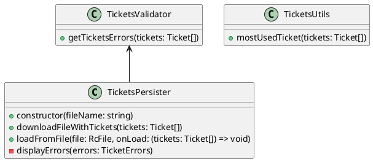

## Class Diagram

```plantuml
@startuml
class TicketsPersister {
  + constructor(fileName: string)
  + downloadFileWithTickets(tickets: Ticket[])
  + loadFromFile(file: RcFile, onLoad: (tickets: Ticket[]) => void)
  - displayErrors(errors: TicketErrors)
}

class TicketsValidator {
  + getTicketsErrors(tickets: Ticket[])
}

class TicketsUtils {
  + mostUsedTicket(tickets: Ticket[])
}

TicketsValidator <-- TicketsPersister
@enduml
```
