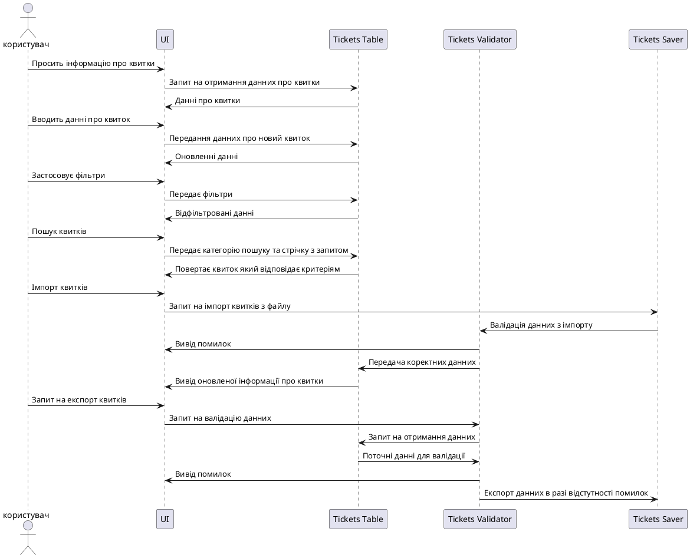

## Sequence Diagram

```plantuml
@startuml
actor       користувач   as A
participant UI
participant "Tickets Table" as T
participant "Tickets Validator" as V
participant "Tickets Saver" as S

A -> UI : Просить інформацію про квитки
UI -> T : Запит на отримання данних про квитки
T -> UI : Данні про квитки

A -> UI : Вводить данні про квиток
UI -> T : Передання данних про новий квиток
T -> UI : Оновленні данні

A -> UI : Застосовує фільтри
UI -> T : Передає фільтри
T -> UI : Відфільтровані данні

A -> UI : Пошук квитків
UI -> T : Передає категорію пошуку та стрічку з запитом
T -> UI : Повертає квиток який відповідає критеріям

A -> UI : Імпорт квитків
UI -> S : Запит на імпорт квитків з файлу
S -> V : Валідація данних з імпорту
V -> UI : Вивід помилок
V -> T : Передача коректних данних
T -> UI : Вивід оновленої інформації про квитки

A -> UI : Запит на експорт квитків
UI -> V : Запит на валідацію данних
V -> T : Запит на отримання данних
T -> V : Поточні данні для валідації
V -> UI : Вивід помилок
V -> S : Експорт данних в разі відстутності помилок


@enduml
```
