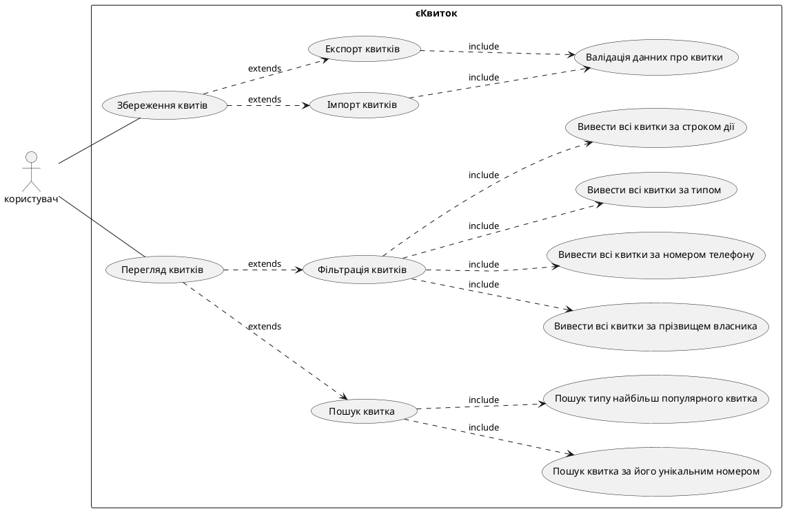

## Use Case Diagram

```plantuml
@startuml
left to right direction
skinparam packageStyle rectangle
actor користувач
rectangle єКвиток {
  користувач -- (Збереження квитів)
  (Збереження квитів) ..> (Імпорт квитків) : extends
  (Збереження квитів) ..> (Експорт квитків) : extends
  (Імпорт квитків) ...> (Валідація данних про квитки) : include
  (Експорт квитків) ...> (Валідація данних про квитки) : include


  користувач -- (Перегляд квитків)
  (Перегляд квитків) ..> (Пошук квитка) : extends
  (Перегляд квитків) ..> (Фільтрація квитків) : extends

  (Фільтрація квитків) ...> (Вивести всі квитки за прізвищем власника) : include
  (Фільтрація квитків) ...>  (Вивести всі квитки за номером телефону) : include
  (Фільтрація квитків) ...>  (Вивести всі квитки за типом) : include
  (Фільтрація квитків) ...>  (Вивести всі квитки за строком дії) : include

  (Пошук квитка) ...> (Пошук квитка за його унікальним номером) : include
  (Пошук квитка) ...> (Пошук типу найбільш популярного квитка) : include
}
@enduml
```
