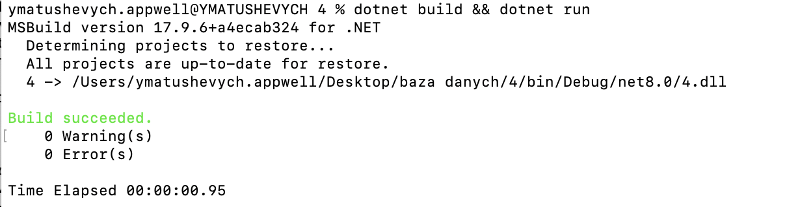

== Лабораторна робота №4: SQLite - вбудована БД

Автор: Матушевич Ярослав, студент ТУ-8-21-Б1ІПЗ(4.6здс)

*Тема:* SQLite - вбудована БД.

*Мета:* Розробити програму на мові C#, що задовольняє вимоги лабораторної роботи 3.1. Додаток створює БД і виконує кілька операторів вставки для початкового наповнення. Операції вибірки виконувати.

== Виконання

[source,csharp]
----
include::Program.cs[]
----

== Висновок

У ході виконання лабораторної роботи №4 на тему "SQLite - вбудована БД", я, Матушевич Ярослав, студент групи ТУ-8-21-Б1ІПЗ(4.6здс), розробив програму на мові C#, що відповідає всім вимогам задачі лабораторної роботи 3.1. Програма успішно створює базу даних lab4.db та виконує оператори вставки для формування початкових даних у таблицях A та veryLongNameOfTable, заповнюючи їх вказаними значеннями, включно з NULL.

Окрім створення та наповнення таблиць даними, було виконано різноманітні оператори вибірки з використанням різних типів JOIN (CROSS JOIN, LEFT JOIN тощо), що дозволило демонструвати можливості SQLite для здійснення складних запитів до бази даних. Це підкреслило ефективність SQLite як легковагової, але потужної системи управління базами даних, здатної задовольняти потреби навіть у складних операторах вибірки.

Реалізація програми також включала в себе застосування передових практик роботи з базами даних, таких як коректне управління ресурсами через використання конструкції using, що забезпечує автоматичне закриття з'єднань та інших ресурсів, тим самим запобігаючи витоку пам'яті.

Проведена робота засвідчила, що SQLite є ідеальним вибором для проектів, де необхідна легка та надійна вбудована база даних. Вона пропонує широкий спектр можливостей для управління даними без потреби у складному налаштуванні чи адмініструванні, що робить її відмінним рішенням для розробки десктопних, мобільних або вбудованих додатків.

Виконання цієї лабораторної роботи не тільки дозволило глибше зрозуміти принципи роботи з реляційними базами даних та їх застосування на практиці, але й покращило навички програмування на C# та роботи з бібліотекою Microsoft.Data.Sqlite.