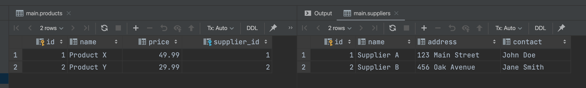

== Лабораторна робота №2

Автор: Ясногородський Нікіта Вікторович, ТУ-12-22-Б1ІПЗ

*Тема:* Скрипт для генерації бази даних постачальників.

*Мета:* Згенерувати базу даних постачальників з урахуванням основних принципів створення та налагодження скриптів з декількох операторів.

== Виконання

[start={list-counter}]
{counter:list-counter}. Створення таблиць:

[source,sql]
----
CREATE TABLE IF NOT EXISTS suppliers (
    id INTEGER PRIMARY KEY AUTOINCREMENT,
    name VARCHAR(255),
    address VARCHAR(255),
    contact VARCHAR(255)
);
----

В цьому блоку коду таблиця `suppliers`, яка містить інформацію про постачальників. Кожен постачальник має унікальний ідентифікатор `id`, назву компанії, адресу та контактну особу.

{counter:list-counter}. Створення таблиці продуктів:

[source,sql]
----
CREATE TABLE IF NOT EXISTS products (
    id INTEGER PRIMARY KEY AUTOINCREMENT,
    name VARCHAR(255),
    price DECIMAL(10,2),
    supplier_id INT,
    FOREIGN KEY (supplier_id) REFERENCES suppliers(id)
);
----

У цьому блоку коду створюється таблиця `products`, яка містить інформацію про продукти. Кожен продукт має унікальний ідентифікатор `id`, назву продукту, ціну та зв'язок з постачальником через поле `supplier_id`, яке є зовнішнім ключем, посилаючимся на поле `id` в таблиці `suppliers`.

{counter:list-counter}. Вставка декількох записів в таблиці постачальників та продуктів:

[source,sql]
----
INSERT INTO suppliers (name, address, contact) VALUES
('Supplier A', '123 Main Street', 'John Doe'),
('Supplier B', '456 Oak Avenue', 'Jane Smith');

INSERT INTO products (name, price, supplier_id) VALUES
('Product X', 49.99, 1),
('Product Y', 29.99, 2);
----

У цьому блоку коду виконується вставка декількох записів у таблиці `suppliers` та `products`. Ці дані створюють декілька постачальників та продуктів із зазначенням їхніх характеристик.

{counter:list-counter}. Виконання оператора вибірки для перевірки даних:

[source,sql]
----
SELECT * FROM suppliers;
SELECT * FROM products;
----

Опис: У цьому блоку коду виконується запит на вибірку всіх записів з таблиць `suppliers` та `products`, щоб перевірити, чи були дані вставлені коректно.

== Висновок

У ході виконання лабораторної роботи було успішно створено базу даних для зберігання інформації про постачальників та їхні продукти. В таблиці "suppliers" знаходяться дані про постачальників, зокрема їх назви, адреси та контактні особи. Таблиця "products" містить інформацію про продукти, включаючи їхні назви, ціни та посилання на відповідного постачальника. Кілька записів було успішно вставлено в кожну таблицю, і також було виконано запити для перевірки даних. Усі етапи виконані правильно та без помилок.
