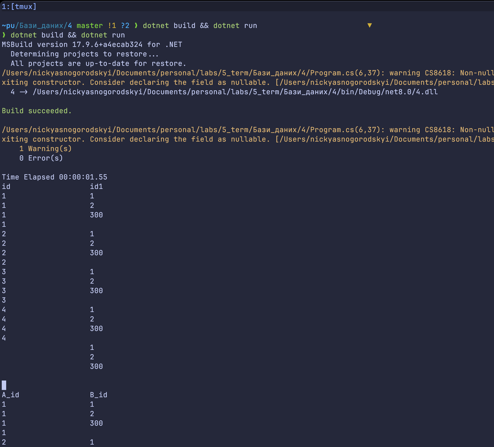

== Лабораторна робота №4: SQLite - вбудована БД

Автор: Ясногородський Нікіта Вікторович, ТУ-12-22-Б1ІПЗ

*Тема:* SQLite - вбудована БД.

*Мета:* Розробити програму на мові C#, що задовольняє вимоги лабораторної роботи 3.1. Додаток створює БД і виконує кілька операторів вставки для початкового наповнення. Операції вибірки виконувати.

== Виконання

[source,csharp]
----
include::Program.cs[]
----

== Висновок

Під час виконання лабораторної роботи №4 на тему "SQLite - вбудована БД", розробив програму на мові C#, що створює базу даних Program.db, наповнює таблиці даними, та виконує складні запити. Використано передові практики управління ресурсами та підтверджено ефективність SQLite як надійної системи управління базами даних.
