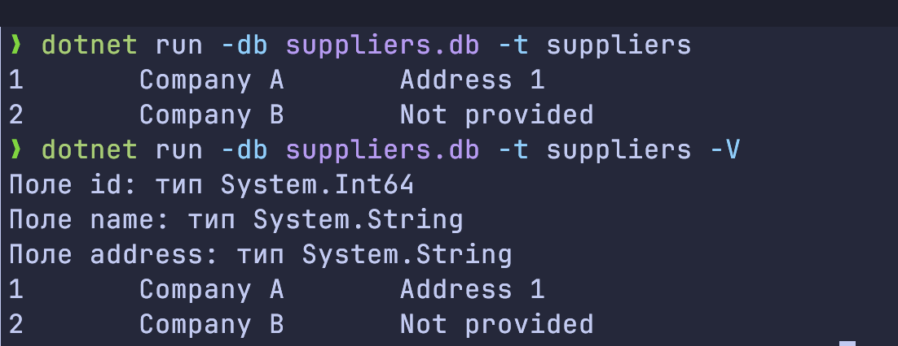

== Лабораторна робота №5: Експорт даних з таблиці

Автор: Ясногородський Нікіта Вікторович, ТУ-12-22-Б1ІПЗ

Тема:: Виконання операторів, які повертають безліч рядків.

Мета:: Розробити програму, яка для заданої бази даних витягує вміст заданої таблиці і, опціонально, надає довідкову інформацію по таблиці (заголовки і типи полів).

== Виконання

Програма, написана на мові C#, використовує бібліотеку для роботи з SQLite базами даних. Вона отримує вхідні аргументи з командного рядка і витягує дані з вказаної таблиці у заданій базі даних. При потребі програма може вивести інформацію про заголовки та типи полів таблиці.

.Аргументи командного рядка:
* `-db <filepath>`: шлях до файлу бази даних
* `-t <name>`: ім'я таблиці
* `-V`: якщо вказаний, виводить імена і типи полів таблиці, загальну кількість витягнутих записів та час роботи програми.

[source,csharp]
----
include::Program.cs[]
----

== Висновок

У ході цієї лабораторної роботи була розроблена програма на мові C#, яка дозволяє експортувати дані з таблиць SQLite бази даних. Програма відповідає вимогам завдання та надає корисний функціонал для зручної роботи з даними.
