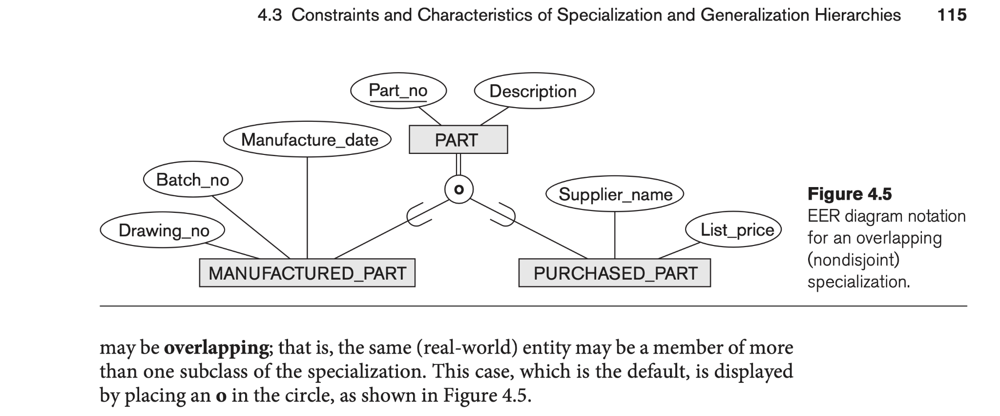
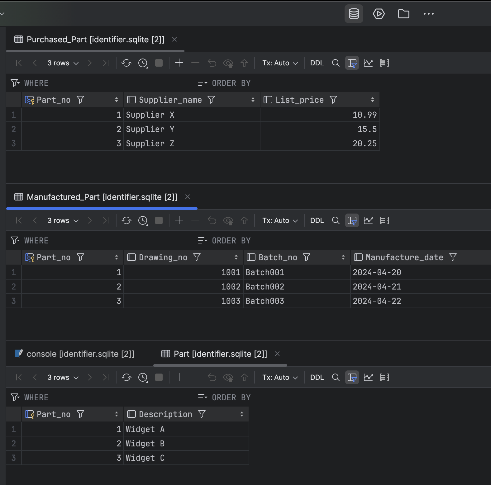

== Модульна контрольна робота

Автор: Ясногородський Нікіта Вікторович, ТУ-12-22-Б1ІПЗ

== Завдання
Обрано варіант 5:
[quote]
Генерації і початкового наповнення БД Постачальників

== Виконання

=== Опис системи бази даних

=== Створення схеми таблиць
[source,sql]
----
CREATE TABLE Part (
    Part_no INT PRIMARY KEY,
    Description VARCHAR(255)
);

CREATE TABLE Purchased_Part (
    Part_no INT PRIMARY KEY,
    Supplier_name VARCHAR(255),
    List_price DECIMAL(10, 2),
    FOREIGN KEY (Part_no) REFERENCES Part(Part_no)
);

CREATE TABLE Manufactured_Part (
    Part_no INT PRIMARY KEY,
    Drawing_no INT,
    Batch_no VARCHAR(50),
    Manufacture_date DATE,
    FOREIGN KEY (Part_no) REFERENCES Part(Part_no)
);
----

=== Наповнення таблиць
[source,sql]
----
INSERT INTO Part (Part_no, Description)
VALUES
    (1, 'Widget A'),
    (2, 'Widget B'),
    (3, 'Widget C');

INSERT INTO Purchased_Part (Part_no, Supplier_name, List_price)
VALUES
    (1, 'Supplier X', 10.99),
    (2, 'Supplier Y', 15.50),
    (3, 'Supplier Z', 20.25);

INSERT INTO Manufactured_Part (Part_no, Drawing_no, Batch_no, Manufacture_date)
VALUES
    (1, 1001, 'Batch001', '2024-04-20'),
    (2, 1002, 'Batch002', '2024-04-21'),
    (3, 1003, 'Batch003', '2024-04-22');
----

=== Перегляд данних у таблицях

== Висновок

У результаті виконання модульної контрольної роботи були написани скрипти для генерація та наповнення БД Постачальників
