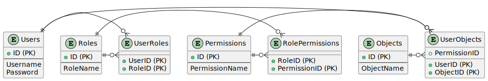

== Модульна контрольна робота

Автор: Ясногородський Нікіта Вікторович, ТУ-12-22-Б1ІПЗ

== Завдання
Обрано варіант 6:
[quote]
Розробити консольний додаток для генерації і початкового наповнення БД системи обмеження доступу.

Отож, завданя полягає у тому, щоб розробити систему обмеження доступу, що включає розробку схеми БД та консольного додатку на C# для генерації і початкового наповнення даними.

== Виконання

Отримавши вимоги до створення системи бази даних для обмеження доступу, ми розробили ретельно спроектовану систему, яка має на меті забезпечити безпеку, структурованість та ефективне управління доступом користувачів до різних об'єктів у системі.

=== Загальний опис системи

Наша система бази даних для обмеження доступу містить набір таблиць, які взаємодіють між собою, щоб забезпечити ефективне управління доступом. Вона включає в себе такі ключові складові:

- *Користувачі (Users)*: Ця таблиця містить інформацію про користувачів системи, які мають доступ до різних об'єктів. Кожен користувач має унікальний ідентифікатор, ім'я та захешований пароль.

- *Ролі (Roles)*: Ролі визначають групи користувачів зі схожими правами доступу. Ця таблиця містить перелік ролей з унікальним ідентифікатором та назвою.

- *Права доступу (Permissions)*: Права доступу визначають конкретні дії, які можуть бути виконані з об'єктами. Вони можуть бути, наприклад, "читання", "запису" чи "видалення". Кожне право доступу має унікальний ідентифікатор та назву.

- *Об'єкти (Objects)*: Об'єкти представляють собою різні елементи системи, до яких можуть бути надані права доступу. Наприклад, це можуть бути файли, директорії, документи тощо. Кожен об'єкт має унікальний ідентифікатор та назву.

- *Зв'язки між сутностями*: Щоб забезпечити функціональність системи, ми створили додаткові таблиці для відображення зв'язків між користувачами та їх ролями, ролями та правами доступу, а також між користувачами, об'єктами та правами доступу.

Ця система бази даних ретельно спроектована для забезпечення безпеки, ефективного управління доступом та структурування даних в інформаційній системі.

=== Для чого це потрібно

1. *Забезпечення безпеки*: Система бази даних для обмеження доступу допомагає захистити конфіденційні дані від несанкціонованого доступу шляхом розподілу прав доступу між користувачами.

2. *Ефективне управління доступом*: За допомогою ролей та прав доступу можна ефективно контролювати, які користувачі мають доступ до конкретних об'єктів та які дії вони можуть виконувати.

3. *Структурування даних*: Ретельно спроектована структура бази даних дозволяє зберігати та організовувати дані таким чином, щоб вони були легко доступні та зрозумілі для подальшого використання.

4. *Скорочення ризику помилок*: Використання бази даних допомагає уникнути помилок, пов'язаних з неправильним управлінням доступом, оскільки права доступу можна легко налаштувати та змінити в одному місці.

Отже, система бази даних для обмеження доступу є ключовою складовою для забезпечення безпеки та ефективного управління доступом у будь-якій інформаційній системі.

=== Опис системи бази даних

Система бази даних для обмеження доступу призначена для управління правами доступу користувачів до різних об'єктів. У системі існують такі сутності:

- **Користувачі (Users)**: представляють користувачів системи з унікальним ідентифікатором, ім'ям та паролем.
- **Ролі (Roles)**: представляють ролі користувачів, які визначають їхні права доступу. Роль має унікальний ідентифікатор та назву.
- **Права доступу (Permissions)**: визначають можливості доступу користувачів до об'єктів. Право доступу має унікальний ідентифікатор та назву.
- **Об'єкти (Objects)**: це різні об'єкти в системі, до яких можуть бути надані права доступу. Об'єкт має унікальний ідентифікатор та назву.

=== Схема таблиць

.Таблиця `Users`:
* `UserId (INT, PRIMARY KEY)` - унікальний ідентифікатор користувача
* `Username (NVARCHAR(50))` - ім'я користувача
* `Password (NVARCHAR(50))` - пароль користувача

.Таблиця `Roles`:
* `RoleId (INT, PRIMARY KEY)` - унікальний ідентифікатор ролі
* `RoleName (NVARCHAR(50))` - назва ролі

.Таблиця `Permissions`:
* `PermissionId (INT, PRIMARY KEY)` - унікальний ідентифікатор права доступу
* `PermissionName (NVARCHAR(50))` - назва права доступу

.Таблиця `Objects`:
* `ObjectId (INT, PRIMARY KEY)` - унікальний ідентифікатор об'єкта
* `ObjectName (NVARCHAR(50))` - назва об'єкта

.Таблиця `UserRoles`:
* `UserId (INT, FOREIGN KEY)` - ідентифікатор користувача
* `RoleId (INT, FOREIGN KEY)` - ідентифікатор ролі

.Таблиця `RolePermissions`:
* `RoleId (INT, FOREIGN KEY)` - ідентифікатор ролі
* `PermissionId (INT, FOREIGN KEY)` - ідентифікатор права доступу

.Таблиця `UserObjectPermissions`:
* `UserId (INT, FOREIGN KEY)` - ідентифікатор користувача
* `ObjectId (INT, FOREIGN KEY)` - ідентифікатор об'єкта
* `PermissionId (INT, FOREIGN KEY)` - ідентифікатор права доступу

=== Код програми

[source,csharp]
----
include::Main.cs[]
----

== Висновок

У результаті виконання модульної контрольної роботи була розроблена гнучка система обмеження доступу з можливістю контролю прав користувача через базу данних. Також було розроблено консольну програму на мові C#, яка генерує випадкові дані для користувачів, ролей, прав доступу та об'єктів і здійснює наповнення бази даних цими даними для системи обмеження доступу. 
