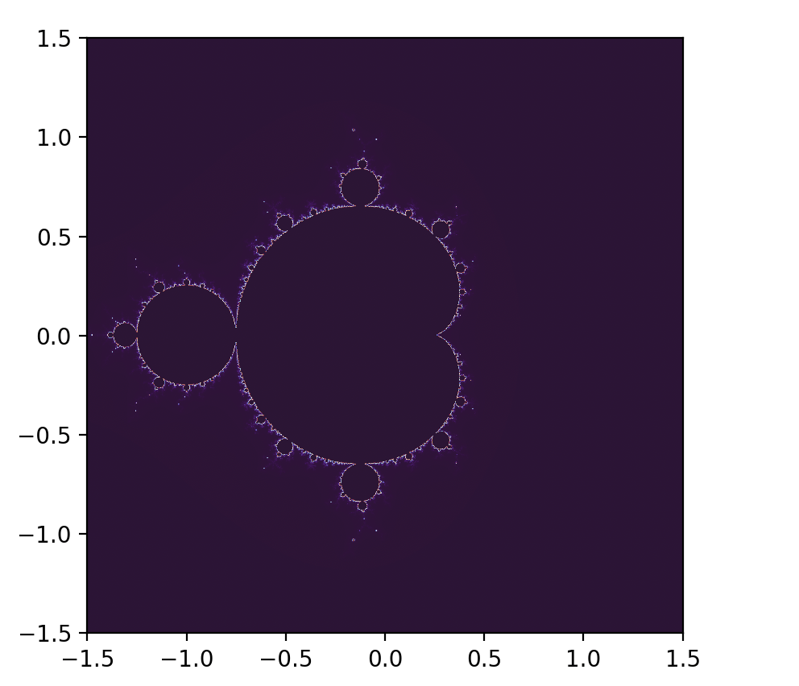

== Звіт за практичну роботу №1. Фрактали.

Автор: Ясногородський Нікіта Вікторович, ТУ-12-22-Б1ІПЗ

== Вступ

У даному звіті буде представлено результати виконання практичної роботи №1 з теми "Фрактали". У ході цієї роботи був розроблений програмний застосунок для відображення фракталів. Під час розробки використовувалася мова програмування Python та бібліотека matplotlib для створення графічного інтерфейсу. Для відображення був використаний фрактал Множина Мандельброта.

== Теоретичний огляд

Фрактал - це складна геометрична форма, що складається з частин, які є зменшеними копіями цілого фракталу і виявляють самоподібність на різних масштабах. Використання фракталів поширене в областях, таких як візуальні ефекти, комп'ютерна графіка, телекомунікації та інші.

Множина Мандельброта - це один з найвідоміших фракталів, який використовується у комп'ютерній графіці. Вона включає в себе множину комплексних чисел, для кожного з яких ітераційна функція z = z^2 + c застосовується знову й знову до значення z не перевищить певного порогу або досягне максимальної кількості ітерацій.

== Хід роботи

Нижче наведено відрізок коду програмного застосунку, написаного на мові програмування Python, який використовує бібліотеку matplotlib для відображення Множини Мандельброта:

[source, python]
----
include::main.py[]
----

== Висновок

Під час виконання практичної роботи був розроблений програмний застосунок для відображення Множини Мандельброта - складного фрактала. Використання математичних концепцій фракталів та програмування дозволило створити графічне представлення цього складного об'єкта. Даний застосунок може бути корисним для візуалізації та дослідження фрактальних структур у різних галузях науки та технологій.
