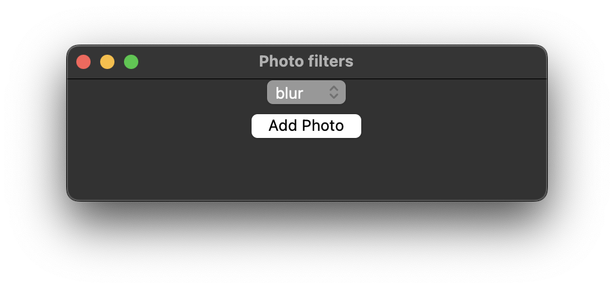
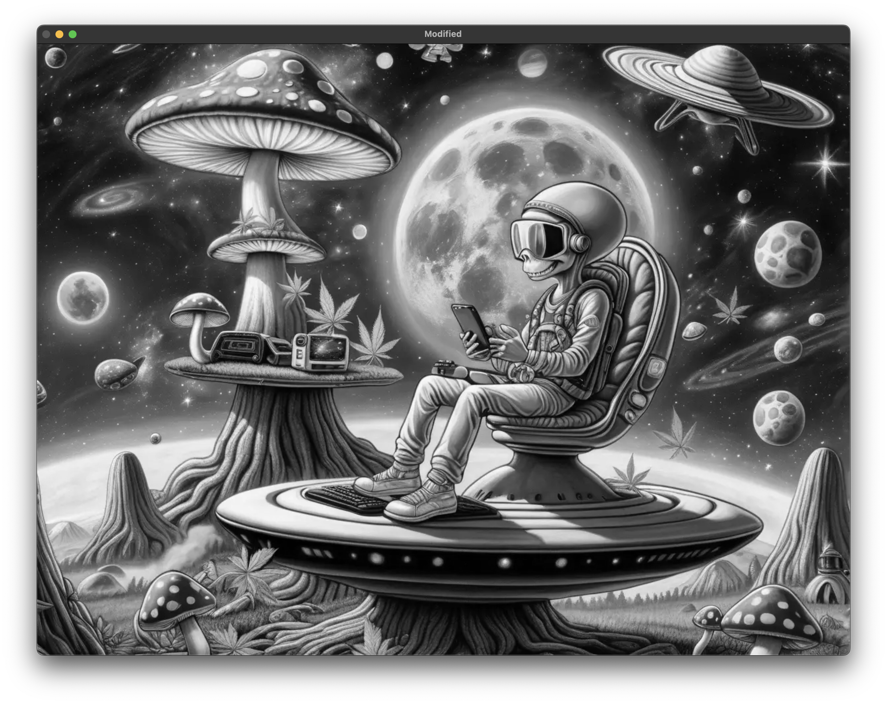

== Звіт за практичну роботу №4. Фільтри

Автор: Ясногородський Нікіта Вікторович, ТУ-12-22-Б1ІПЗ

=== Опис завдання

У цій практичній роботі розроблено програмне забезпечення з графічним інтерфейсом для накладання різних фільтрів на зображення. Мінімум три фільтри було реалізовано.

=== Опис ПЗ

Програма має наступний функціонал:
- Можливість завантаження будь-якого зображення з комп'ютера користувача.
- Вибір фільтрів з графічного інтерфейсу.
- Накладання обраних фільтрів на завантажене зображення.
- Збереження обробленого зображення на комп'ютер користувача.

=== Реалізовані фільтри

1. Фільтр "Блюр": Замилює зображення.
2. Фільтр "Чорно-білий": Конвертує зображення у чорно-білий варіант.
3. Фільтр "Негатив": Інвертує кольори зображення, створюючи ефект негативу.

=== Хід роботи

Програма була розроблена з використанням мови програмування Python та бібліотеки Tkinter для створення графічного інтерфейсу.

[source, python]
----
include::main.py[]
----

Інтерфейс програми:

Фільтр "Чорно-білий":

Фільтр "Блюр":

image::blur.png[]

Фільтр "Негатив":

image::negative.png[]

=== Висновок

Під час виконання цієї практичної роботи було створено програмне забезпечення з графічним інтерфейсом для застосування різних фільтрів до зображень. У програмі реалізовано три різні фільтри, що дає користувачеві змогу легко модифікувати вигляд зображення.
