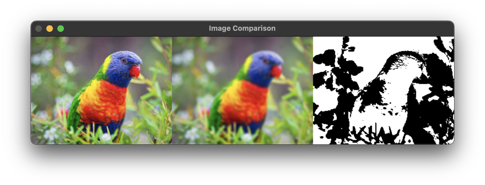

== Звіт за практичну роботу №5. Сегментація зображення.

Автор: Ясногородський Нікіта Вікторович, ТУ-12-22-Б1ІПЗ

=== Опис завдання

Метою цієї практичної роботи було розробити програмне забезпечення, яке дозволяє накладати різні фільтри на зображення та виконувати сегментацію обраного зображення.

=== Алгоритм сегментації

Сегментація зображення полягає у його розділенні на окремі частини або області, які відображають об'єкти чи області інтересу. Цей процес сприяє відокремленню об'єктів на зображенні від тла чи інших об'єктів.

Для виконання сегментації використовуються різноманітні алгоритми, такі як порогова обробка, водоподіл, алгоритми кластеризації та інші. У даному прикладі ми застосуємо порогову обробку для розділення зображення на області на основі певного порогу яскравості для забезпечення простоти виконання.

=== Опис програмного забезпечення

.Програма має наступний функціонал:
* Завантаження зображення з пристрою користувача.
* Вибір фільтрів з графічного інтерфейсу.
* Накладання обраних фільтрів.
* Сегментація зображення на основі порогової обробки.
* Відображення оригінального зображення, зображення з накладеними фільтрами та сегментованого зображення.

[source, python]
----
include::main.py[]
----

Головний інтерфейс програми:

Фільтр "Блюр" з оригінальним та сегментованим зображення для порівняння:

=== Висновок

Під час виконання даної практичної роботи було успішно розроблено програмне забезпечення, яке дозволяє застосовувати різноманітні фільтри до зображень та виконувати їх сегментацію на основі порогової обробки. Для цього були використані інструменти мови програмування Python та бібліотеки Tkinter та OpenCV.
