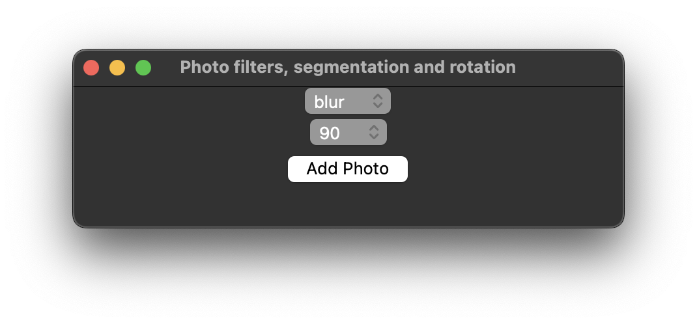
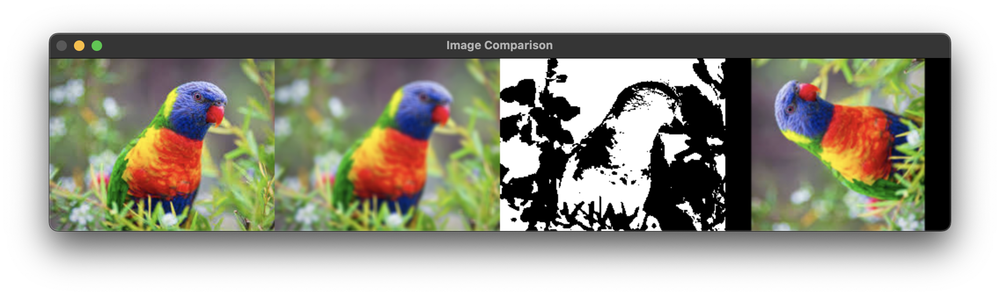
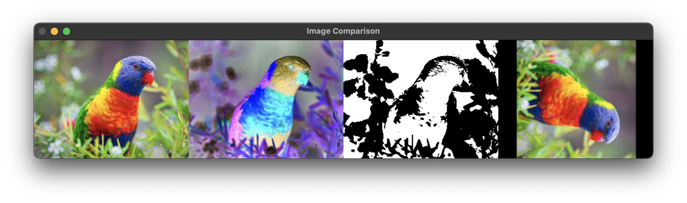

== Звіт за практичну роботу №6. Двовимірне обертання зображення навколо осі.

Автор: Ясногородський Нікіта Вікторович, ТУ-12-22-Б1ІПЗ

=== Завдання

Метою практичної роботи було розширення функціональності програми, реалізованої у попередній практичній роботі, шляхом додавання можливості обертання зображення навколо осей `x` та `y`.

=== Хід роботи

1. Функціонал обертання зображення навколо осей `x` та `y` успішно реалізовано.
2. Було проведено тестування програми з використанням різних зображень та кутів обертання.
3. Отримано результати візуалізації обернених зображень з метою проведення аналізу.

[source, python]
----
include::main.py[]
----

Інтерфейс програми:

Оберти 90, 180 та 270 градусів:

=== Висновок

Виконання практичної роботи дозволило успішно розширити функціональність програмного забезпечення для обробки зображень. Додавання можливості обертання зображення навколо осей `x` та `y` зробило програму більш універсальною та корисною для використання. У ході роботи були отримані нові навички у роботі з обробкою зображень та застосуванні алгоритмів обертання.
